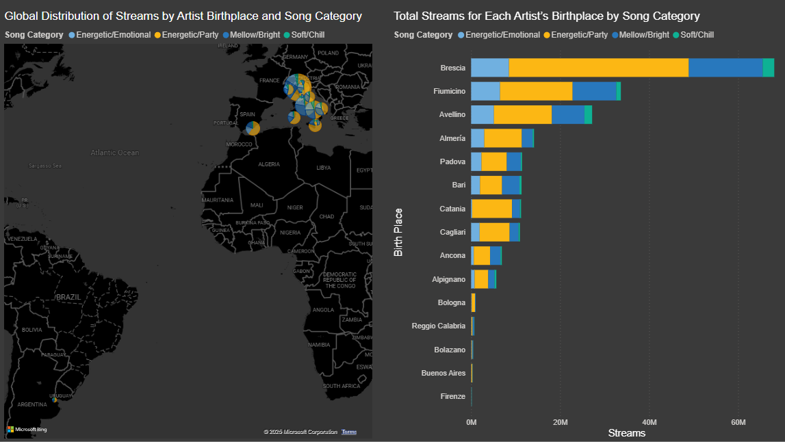
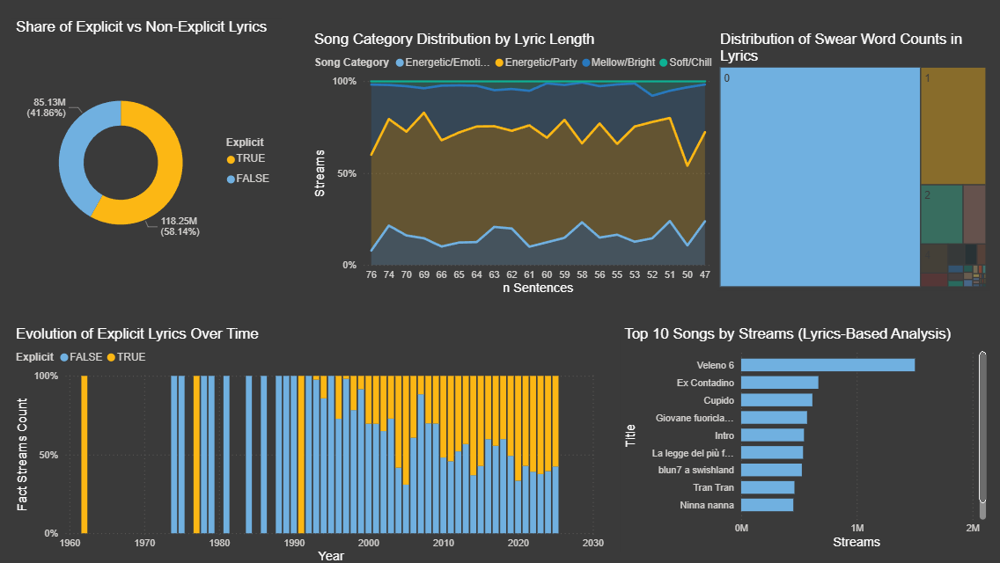
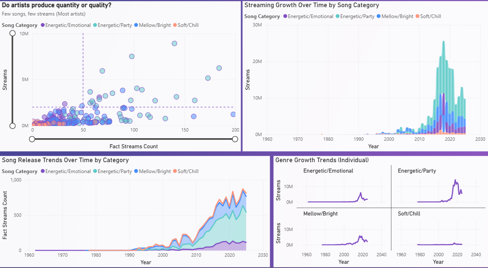

# Music Streaming Analytics & Decision Support System

An end-to-end data engineering, OLAP, and business intelligence project built with **Python, SQL Server, SSIS, SSAS Multidimensional, MDX, and Power BI**.

The project transforms raw music-streaming data into a structured analytical system: source data is profiled and cleaned in Python, organized into a dimensional warehouse, transformed through SSIS, exposed through an SSAS multidimensional cube, queried with MDX, and presented through Power BI dashboards.

> **Authors:** Fiza Naeem and Zahra Hameed Khan  
> MSc Data Science and Business Informatics — University of Pisa

## Project at a glance

```text
Raw Data
   ↓
Python Data Preparation
   ↓
SQL Server Data Warehouse
   ↓
SSIS ETL & Analytical Transformations
   ↓
SSAS Multidimensional Cube
   ↓
MDX Analysis
   ↓
Power BI Decision-Support Dashboards
```

The analytical system supports questions such as:

- Which artists, tracks, and song categories generate the most streams?
- How does streaming performance evolve over time?
- Which song categories are growing or declining?
- How does artist geography relate to streaming performance?
- How are explicit and non-explicit lyrics distributed?
- How do lyrical characteristics relate to streams?
- How do current periods compare with previous periods?
- Does higher artist output necessarily correspond to higher streaming performance?

## Technology stack

| Layer | Technology | Purpose |
|---|---|---|
| Data preparation | Python | Profiling, cleaning, validation, transformation |
| Storage / warehouse | SQL Server | Fact and dimension storage |
| ETL | SSIS | Integration, joins, aggregation, derived features |
| OLAP | SSAS Multidimensional | Dimensions, measures, hierarchies, cube analysis |
| Analytical querying | MDX | Rankings, contributions, growth and time analysis |
| Visualization | Power BI | Interactive decision-support dashboards |
| Version control | GitHub | Public project organization and documentation |

## 1. Data preparation

The first stage inspects and prepares the source music data before loading it into the analytical environment. Work includes schema inspection, missing-value analysis, duplicate and consistency checks, type validation, cleaning, preprocessing, and generation of analytics-ready fields.

Relevant implementation:

```text
data-preparation/
├── assignment-01/
├── assignment-02/
└── assignment-03/
```

The original public artist source is available in [`data/raw/`](data/raw/). The project also used a track-level JSON source containing music metadata, audio features, streaming measures and lyrical content; that source file is intentionally not redistributed in the public repository because it contains full song lyrics.

## 2. Data warehouse

Prepared data is organized into a dimensional model separating measurable streaming activity from descriptive dimensions.

Core analytical entities include:

- **Artist** — artist identity, demographic and geographic attributes
- **Track** — track metadata, lyrical/audio attributes and song categories
- **Time** — date, period, quarter and seasonal analysis
- **Fact Streams** — streaming and popularity measures linked to the dimensions

Relevant implementation:

```text
data-warehouse/
├── assignment-04/
├── assignment-05/
└── assignment-06/
```

Assignment 6 demonstrates programmatic loading into SQL Server. Its public version reads connection details from environment variables rather than storing credentials in source code.

## 3. SSIS ETL and analytical transformation

SSIS packages implement the transformation layer used for downstream analytics. The workflows include extraction, joins, lookups, sorting, aggregation, derived columns, regional/category calculations, artist trend measures, gender-based analysis and explicit-content analysis.

```text
ssis-etl/
├── assignment-09/
├── assignment-10/
├── assignment-11/
├── assignment-12/
└── assignment-13/
```

Public SSIS packages use placeholders such as `YOUR_SQL_SERVER`, `YOUR_DATABASE`, and `YOUR_SQL_USERNAME`; local machine/user metadata has also been sanitized where appropriate.

## 4. SSAS multidimensional model

The warehouse is exposed through an **SSAS Multidimensional** project containing dimensions, cube definitions, relationships, measures, partitions and data-source configuration.

Major analytical dimensions are:

- **Artist**
- **Track**
- **Time**

The model enables slicing and aggregation of streaming measures across time, geography, artist attributes and song characteristics.

See [`ssas-cube/`](ssas-cube/).

## 5. MDX analytical layer

MDX is used for multidimensional analysis directly against the cube. The work includes:

- ranking and Top-N analysis;
- geographic and regional analysis;
- weighted main/featured artist contribution;
- year-over-year comparison;
- seasonal benchmarking;
- category growth calculations;
- market-share / growth-share analysis.

A conceptual year-over-year calculation is:

```text
Growth % =
(Current Period Streams - Previous Period Streams)
-------------------------------------------------- × 100
              Previous Period Streams
```

See [`mdx-analysis/`](mdx-analysis/).

## 6. Power BI dashboards

The final layer converts the analytical model into decision-support dashboards. Each public Power BI folder includes a dashboard image, a sanitized PBIX copy and a focused README.

### Dashboard 20 — Geographic Streaming Analysis

Analyzes stream distribution by artist birthplace and song category, combining geographic visualization with ranked birthplace-level totals.

[Open Assignment 20](power-bi/assignment-20/)



### Dashboard 21 — Lyrical Content Analysis

Explores explicit vs non-explicit content, lyric length, swear-word frequency, evolution of explicit content over time, and top songs by streams.

[Open Assignment 21](power-bi/assignment-21/)



### Dashboard 22 — Streaming & Song Category Trends

Analyzes artist output versus streaming performance, streaming growth over time, song-release trends and the trajectories of the four analytical song categories:

- Energetic/Emotional
- Energetic/Party
- Mellow/Bright
- Soft/Chill

[Open Assignment 22](power-bi/assignment-22/)



## Analytical story

The project follows a complete **data-to-decision** workflow:

1. **Understand the data** — profile and clean the source datasets.
2. **Organize it** — design facts and dimensions in SQL Server.
3. **Transform it** — implement analytical ETL workflows in SSIS.
4. **Model it multidimensionally** — build an SSAS cube with measures and hierarchies.
5. **Calculate advanced analytics** — use MDX for ranking, growth, contribution and time comparisons.
6. **Communicate the results** — build Power BI dashboards for geographic, lyrical and temporal/category analysis.

## Repository structure

```text
LDS-Music-Streaming-Analytics/
│
├── data-preparation/
│   ├── assignment-01/
│   ├── assignment-02/
│   └── assignment-03/
│
├── data-warehouse/
│   ├── assignment-04/
│   ├── assignment-05/
│   └── assignment-06/
│
├── data/
│   ├── raw/
│   │   ├── artists.xml
│   │   └── README.md
│   └── processed/
│       └── README.md
│
├── ssis-etl/
│   ├── assignment-09/
│   ├── assignment-10/
│   ├── assignment-11/
│   ├── assignment-12/
│   └── assignment-13/
│
├── ssas-cube/
│   └── multidimensional OLAP model
│
├── mdx-analysis/
│   └── assignments 15–19
│
├── power-bi/
│   ├── assignment-20/
│   ├── assignment-21/
│   └── assignment-22/
│
├── report/
│   └── LDS_Music_Streaming_Analytics_Report_Public.pdf
│
├── .gitignore
└── README.md
```

## Project report

The full sanitized public report documents the complete workflow, implementation and analytical results:

**[Open the project report](report/LDS_Music_Streaming_Analytics_Report_Public.pdf)**

## Key skills demonstrated

**Data engineering:** profiling, cleaning, transformation, ETL design, relational loading.  
**Data warehousing:** dimensional modeling, facts/dimensions, SQL Server implementation.  
**Business intelligence:** SSIS, SSAS Multidimensional, OLAP modeling, Power BI.  
**Analytical querying:** MDX, calculated members, ranking, time intelligence and growth analysis.  
**Visualization:** geographic, temporal, category, distribution and performance analysis.

## Security and public-repository sanitization

The original coursework used institutional SQL Server / Analysis Services infrastructure. The public repository has been sanitized so environment-specific credentials and sensitive connection details are not intentionally exposed.

Public artifacts use placeholders such as:

```text
YOUR_SQL_SERVER
YOUR_SQL_USERNAME
YOUR_DATABASE
YOUR_SSAS_ENDPOINT
YOUR_CUBE
```

The Assignment 6 SQL loader uses environment variables for runtime credentials, and the public SSIS, SSAS, Power BI and report artifacts were prepared for portfolio publication.

## Reproducibility notes

A full reproduction requires Microsoft BI tooling, including SQL Server, SSIS, SSAS Multidimensional and Power BI Desktop. Server-dependent artifacts need to be reconnected to the reviewer's own environment using the placeholder connection settings.

Processed/generated CSV outputs are kept alongside the assignment stages that created or used them rather than duplicated under `data/processed/`.

## How to explore

For a quick portfolio review:

```text
README → power-bi/ → report/
```

For implementation details:

```text
data-preparation/ → data-warehouse/ → ssis-etl/ → ssas-cube/ → mdx-analysis/
```

## Project outcome

The final result is an end-to-end **Music Streaming Analytics & Decision Support System** demonstrating how Python, SQL Server, SSIS, SSAS, MDX and Power BI can work together as one integrated analytics pipeline rather than as isolated technologies.

---

## Authors

**Fiza Naeem**  
**Zahra Hameed Khan**

MSc Data Science and Business Informatics  
University of Pisa
